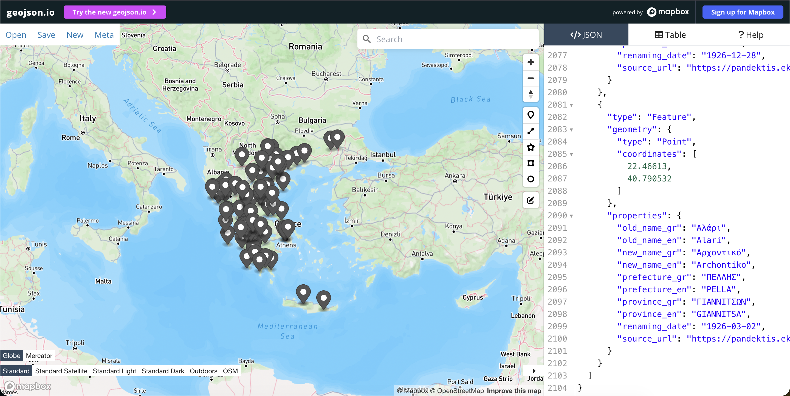

# Pandektis Settlement Renaming Scraper
### Greek Settlement Renamings — EKT / National Documentation Centre

---

## Overview

This toolkit extracts all ~4,413 settlement renaming records from the
[Pandektis database (EKT)](https://pandektis.ekt.gr/pandektis/handle/10442/4968),
geocodes each record using the **new name + prefecture** strategy, and
produces two output files:

| File | Description |
|------|-------------|
| `pandektis_settlements.geojson` | RFC 7946 GeoJSON, UTF-8, WGS84 |
| `pandektis_settlements.xlsx`    | Excel workbook for manual auditing |

---

## Requirements

**Python 3.9+** recommended.

```bash
pip install requests beautifulsoup4 lxml openpyxl geopy tenacity tqdm
```

For the Selenium fallback (if the site requires JavaScript):
```bash
pip install selenium webdriver-manager
# Chrome browser must also be installed
```

---

## Usage

### Step 1 — Try the fast HTTP scraper first

```bash
python pandektis_scraper.py
```

This fetches the full browse page (rpp=4413) and then visits each item page.
It will write a log to `pandektis_scraper.log`.

### Step 2 — If Step 1 returns 0 records, use the Selenium scraper

```bash
python pandektis_selenium.py
```

This launches a headless Chrome browser to render the JavaScript-heavy pages.
Both scripts write to the **same output files**.

---

## Output Schema

### GeoJSON Properties (per Feature)

| Property | Type | Description |
|----------|------|-------------|
| `old_name_gr` | string | Original settlement name in Greek script |
| `old_name_en` | string | Transliterated to Latin (ELOT 743 approx.) |
| `new_name_gr` | string | Current/official name in Greek script |
| `new_name_en` | string | Transliterated to Latin |
| `prefecture`  | string | Nomos (Prefecture) |
| `province`    | string | Eparchia (Province) |
| `renaming_date` | string | ISO-8601 date (YYYY-MM-DD) or raw if unparseable |
| `source_url`  | string | Direct link to the Pandektis record |

### GeoJSON Geometry

- **Type:** `Point`  
- **Coordinates:** `[longitude, latitude]` (WGS84, ≥5 decimal places)  
- Features with no geocoding result have `"geometry": null`

---

## Geocoding Strategy

1. Query: **`{new_name_gr}, {prefecture}, Greece`** → Nominatim (OpenStreetMap)
2. Fallback: **`{new_name_gr}, Greece`**
3. Fallback: **`{old_name_gr}, Greece`** (historical names rarely geocode)

Results are cached in-memory to avoid redundant API calls for repeated place names.
A 1.2-second delay is enforced between Nominatim requests to comply with their ToS.

### Improving geocoding accuracy

For records that fail Nominatim, consider:
- **Google Maps Geocoding API** (higher accuracy, requires API key)
- **HERE Geocoding API**
- **Geonames.org** (has Greek municipality data)

You can replace the `geocode()` function in `pandektis_scraper.py` with any
geocoding provider.

---

## Runtime Estimate

| Phase | ~4,413 records |
|-------|----------------|
| Browse page fetch | < 1 min |
| Item extraction (1s delay) | ~1.2 hours |
| Geocoding (1.2s delay) | ~1.5 hours |
| **Total** | **~3 hours** |

Run overnight or on a server. Progress bars show live status.

---

## Transliteration

A built-in ELOT 743–approximate transliteration converts Greek→Latin for
`old_name_en` / `new_name_en`. For production-quality transliteration,
replace with the `transliterate` library:

```bash
pip install transliterate
```

```python
from transliterate import translit
en_name = translit(gr_name, 'el', reversed=True)
```

---

## Notes on the Handle System

Pandektis uses DSpace's handle resolver. Some records may redirect to a
"modern settlement" record with a different handle. Both scrapers follow
HTTP redirects automatically, so the final URL captured in `source_url`
is always the canonical record page.

---

## License

For academic / research use. Always check EKT's terms of service before
redistributing scraped data.
